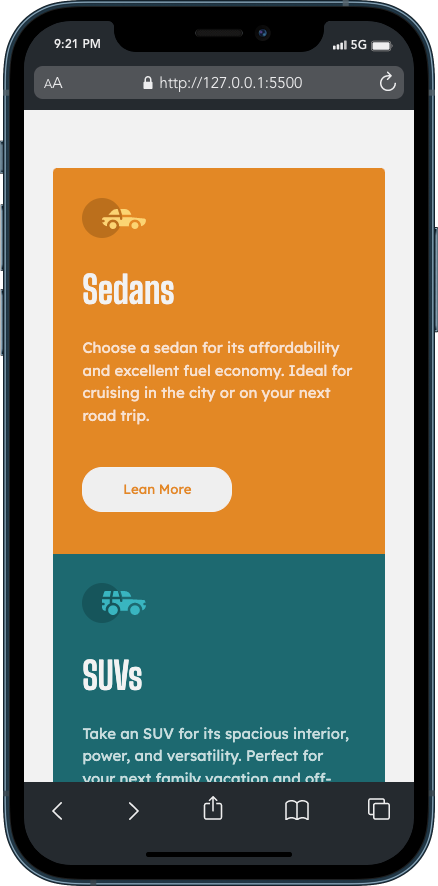

# 
# Frontend Mentor - 3 column preview card solution

This is a solution to the [3-column preview card component challenge on Frontend Mentor](https://www.frontendmentor.io/challenges/3column-preview-card-component-pH92eAR2-). Frontend Mentor challenges help you improve your coding skills by building realistic projects. 

## Table of contents

- [Overview](#overview)
  - [The challenge](#the-challenge)
  - [Screenshot](#screenshot)
  - [Links](#links)
- [My process](#my-process)
  - [Built with](#built-with)
  - [What I learned](#what-i-learned)
- [Author](#author)

## Overview

### The challenge

Users should be able to:

- View the optimal layout depending on their device's screen size
- See hover states for interactive elements

### Screenshots

 

### Links

- Solution URL: [Solution URL](https://www.frontendmentor.io/solutions/3-column-preview-card-24ek__7Q_c)
- Live Site URL: [Live Site](https://glharvey.github.io/3-column-preview-card/)

## My process

### Built with

- Semantic HTML5 markup
- CSS custom properties
- Flexbox
- Mobile-first workflow

### What I learned

It was a pleasure to get a better understanding of Semantic HTML5 markup, Css functions [ clamp(), min(), calc() ]

## Author

- Github Profile - [@glharvey](https://github.com/glharvey)
- Frontend Mentor - [@glharvey](https://www.frontendmentor.io/profile/glharvey)
